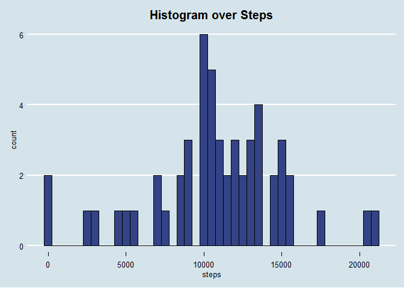
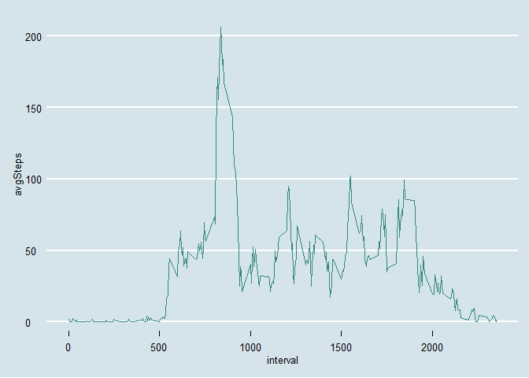

# Reproducible Research: Peer Assessment 1


## Loading and preprocessing the data


```r
if(!file.exists("activity.csv")){
        unzip("activity.zip")
}

data <- read.csv("activity.csv")

require(dplyr)

stepsByDate <- data %>% group_by(date) %>% 
        summarise(steps = sum(steps))

avgStepsByInterval <- data %>% group_by(interval) %>% summarise(avgSteps = mean(steps, na.rm = TRUE))
```


## What is mean total number of steps taken per day?

```r
require(ggplot2)
require(ggthemes)
ggplot(stepsByDate, aes(steps)) + geom_histogram(fill = '#334385', color = 'black', binwidth = 500) + theme_economist() + labs(title = 'Histogram over Steps') + theme(plot.title = element_text(hjust = 0.5))
```

<!-- -->

```r
mean <- mean(stepsByDate$steps, na.rm = TRUE)
median <- median(stepsByDate$steps, na.rm = TRUE)
```
- Mean: 1.0766189\times 10^{4}
- Median: 10765


## What is the average daily activity pattern?

```r
ggplot(avgStepsByInterval, aes(interval, avgSteps)) + geom_line(color ='#33877D') + theme_economist()
```

<!-- -->

```r
maxInterval <- avgStepsByInterval$interval[which.max(avgStepsByInterval$avgSteps)]
```
- Interval which has the maximum of average steps: 835


## Imputing missing values


## Are there differences in activity patterns between weekdays and weekends?
