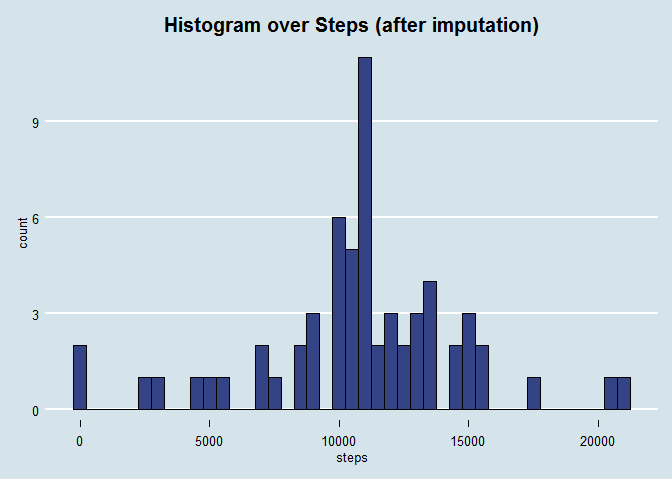

# Reproducible Research: Peer Assessment 1


```
## [1] "English_United States.1252"
```


## Loading and preprocessing the data


```r
require(dplyr, quietly = TRUE)


if(!file.exists("activity.csv")){
        unzip("activity.zip")
}

data <- read.csv("activity.csv")


stepsByDate <- data %>% group_by(date) %>% 
        summarise(steps = sum(steps))

avgStepsByInterval <- data %>% group_by(interval) %>% summarise(avgSteps = mean(steps, na.rm = TRUE))
```


## What is mean total number of steps taken per day?

```r
require(ggplot2)
require(ggthemes)
ggplot(stepsByDate, aes(steps)) + geom_histogram(fill = '#334385', color = 'black', binwidth = 500) + theme_economist() + labs(title = 'Histogram over Steps') + theme(plot.title = element_text(hjust = 0.5))
```

<!-- -->

```r
mean <- mean(stepsByDate$steps, na.rm = TRUE)
median <- median(stepsByDate$steps, na.rm = TRUE)
```
- Mean: 1.0766189\times 10^{4}
- Median: 10765


## What is the average daily activity pattern?

```r
ggplot(avgStepsByInterval, aes(interval, avgSteps)) + geom_line(color ='#33877D') + theme_economist()
```

<!-- -->

```r
maxInterval <- avgStepsByInterval$interval[which.max(avgStepsByInterval$avgSteps)]
```
- Interval which has the maximum of average steps: 835


## Imputing missing values

```r
numNA <- sum(is.na(data$steps))
```

- Number of NA's: 2304


```r
dataInput <- data
#[i]

replaceNA <- function(var, interval){
        if(is.na(var)){
                var <- avgStepsByInterval$avgSteps[avgStepsByInterval$interval == interval]
                        #avgStepsByInterval$avgSteps[dataInput$interval == avgStepsByInterval$interval]
        }
        else
                var
}

dataInput$steps <- mapply(replaceNA, dataInput$steps, dataInput$interval)

fill.value <- function(steps, interval) {
    filled <- NA
    if (!is.na(steps))
        filled <- c(steps)
    else
        filled <- (averages[averages$interval==interval, "steps"])
    return(filled)
}

for(i in 1:nrow(dataInput)){
        if(is.na(dataInput$steps[i])){
                dataInput$steps[i] <- avgStepsByInterval$avgSteps[dataInput$interval[i] == avgStepsByInterval$interval]
        }
}


stepsByDateInput <- dataInput %>% group_by(date) %>% 
        summarise(steps = sum(steps))

ggplot(stepsByDateInput, aes(steps)) + geom_histogram(fill = '#334385', color = 'black', binwidth = 500) + theme_economist() + labs(title = 'Histogram over Steps (after imputation)') + theme(plot.title = element_text(hjust = 0.5))
```

<!-- -->

```r
meanInput <- mean(stepsByDateInput$steps, na.rm = TRUE)
medianInput <- median(stepsByDateInput$steps, na.rm = TRUE)
```
- Mean: 1.0766189\times 10^{4}
- Median: 1.0766189\times 10^{4}


## Are there differences in activity patterns between weekdays and weekends?


```r
dataInput$weekpart <- ifelse(as.POSIXlt(dataInput$date)$wday %in% c(6,0), 'weekend', 'weekday')
```
